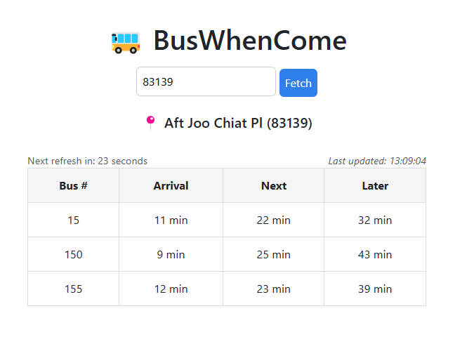

# 🚌 BusWhenCome

**BusWhenCome** is a minimalist web app to check when the next bus will arrive at a bus stop in Singapore.

## 📸 Preview

  
   
  <em>Screenshot of the live app showing upcoming buses</em>

## 💡 Recommendation: How to Use It

Turn **BusWhenCome** into your personal, one-tap bus checker:

1. 🔍 **Find your bus stop ID** (e.g. `83139`)
2. 📱 On your mobile, open:  
   `https://buswhencome-epa5h5bdhba2eya2.southeastasia-01.azurewebsites.net/?stop-id=your_bus_stop_id`
3. ➕ **Add the page to your home screen** using your browser’s "Add to Home Screen" option
4. 🚀 Done! You now have a fast, minimal “app” on your phone for checking your usual bus stop

> Pro tip: Set this up for your morning/evening commute to skip repetitive typing.

## 🚀 Motivation

I wanted a no-nonsense, fast-loading app that shows me exactly what I need: when the next bus is coming.  
No ads, no unnecessary navigation, no bloat — just clean and useful info.

## 🔧 Features (Planned)

- 🔍 Search by bus stop code
- 🕒 Real-time bus arrival info
- 📱 Minimal UI

## ⚙️ Tech Stack

BusWhenCome is built with:
- **Blazor Web App** because I love C#
- **API**: [ArriveLah Proxy](https://github.com/cheeaun/arrivelah) to LTA DataMall
- **Data Source**: SMRT's public list of bus stops

## 📄 Credits

- [cheeaun/arrivelah](https://github.com/cheeaun/arrivelah) – Simple proxy for LTA DataMall's Bus Arrival API
- [SMRT Journey Planner](https://journey.smrt.com.sg/journey/bus_search/bus_stop) – Source for bus stop list

## 📌 Disclaimer

This is an independent project and is not affiliated with LTA, SMRT, SBS Transit, or any official transport providers in Singapore.
